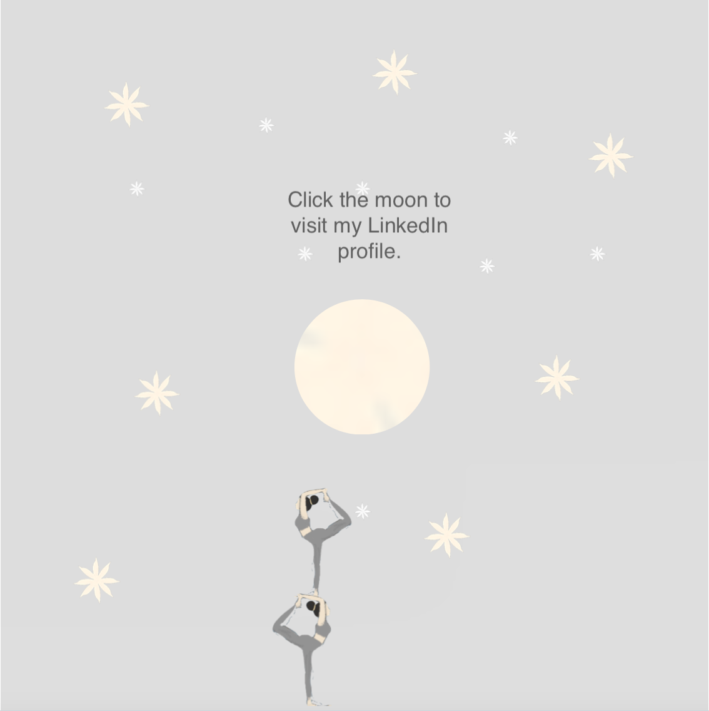

  
  <h1>Hello and Welcome!</h1>
  

    I’m <b>An Yu Chen</b>, a doctoral researcher passionate about uncovering the intricate linkages between science and technology. My research explores how science contributes to green technologies, shaping a sustainable future. Let's dive into a world of ideas, innovation, and impact!
  

  <a href="assets/anyu.pdf" target="_blank" class="button">
    View My CV
  </a>
  

    
    

  <h2>Research Interests</h2>
  

    My research investigates the linkages between science and technology, with a focus on the scientific knowledge base in green technologies. Through this, I aim to explore knowledge flows across fields of science, contributing to science and technology policy discussions.
  

  <h2>Impact</h2>
  

    My work addresses whether science can drive the advancement of emerging technologies, shaping discussions on sustainability and policy while identifying new avenues for research.
  

  <h2>A Little About Me</h2>
  

    I’m a curious, enthusiastic thinker who loves connecting with people and exploring fresh perspectives. I bring energy and creativity into my work and collaborations, always eager to learn and grow.
  

  <h2>Highlights of My Journey</h2>
  <ul class="journey-list">
    <li>
      <strong>PhD in Science, Technology and Innovation Policy</strong> | Alliance Manchester Business School, The University of Manchester (2021-Present)
    </li>
    <li>
      <strong>MSc in Business Administration in Technology Management</strong> | National Tsing Hua University (2013-2015)
    </li>
    <li>
      <strong>Research Assistant</strong> | The University of Manchester (2023-2024)
    </li>
    <li>
      <strong>Teaching Assistant</strong> | Database Systems, The University of Manchester (2023)
    </li>
  </ul>

