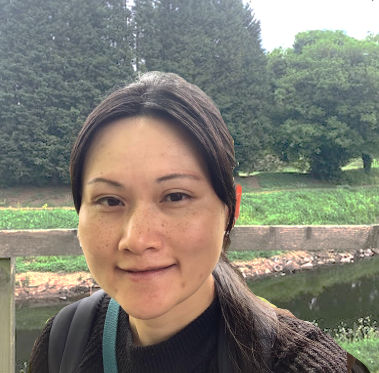

<!-- HERO -->

  
  <h1>An Yu Chen</h1>
  
Innovation Policy & Sustainability Research | Science of Science | PhD in Science, Technology and Innovation Policy (Completed)

  

I am currently working on research projects related to innovation policy, sustainability, environmental economics, and the management of science and technology. My research examines the use and exchange of operant resources among governments, academic institutions, and private firms, drawing upon data from sources including Web of Science, Scopus, and USPTO databases. I aim to continue making a positive impact through excellent research and teaching. Please explore the Research and Teaching sections in the menu for further information. You can always return to this main page by clicking my name, “An Yu Chen,” in the top left corner.
  

  <a href="assets/CV.pdf" target="_blank" class="btn btn-primary">
  View CV
  </a>

  <a href="https://an-yu-chen.github.io/academic.website/autobiography/" class="btn btn-secondary">
  Autobiography
</a>

<!-- TIMELINE -->

  <h2>Academic Milestone Timeline</h2>

  

  

    
2025–2026

    Research Associate in Science of Science, University of Manchester
  

  

      
2021–2025

      PhD in Science, Technology and Innovation Policy, University of Manchester (Completed)
       • Supervisors: Professor Cornelia Lawson and Professor Silvia Massini
       • PhD Viva Examiners: Professor Kieron Flanagan and Professor Fabio Montobbio
    

  

    
2018–2020

    Assistant Editor, Taiwan Hsinchu Industry and Management Forum (Innovation journal publication support and editorial work)
  

  

    
2017–2020

    Research Assistant, Government Science and Technology Policy Projects (MOST, Taiwan)
     • Analysis of national S&T policy frameworks
     • Evaluation of Taiwan’s science and technology development plans
  

  

    
2018

    First academic conference presentation: PICMET (Portland International Conference on Management of Engineering and Technology), Honolulu, USA
  

  

    
2016–2017

    Booking.com — Industry Experience (E-commerce & Tourism Analytics)
  

  

    
2015

    DAAD Research Internship, Otto-von-Guericke University Magdeburg
     Focus: Human-centered design and emotional product development
  

  

    
MSc

    MSc in Technology Management, National Tsing Hua University (Institute of Technology Management)
  

  

    
Early Academic Formation

    Bachelor’s studies in Economics (Arts & Economics background)
     Developed early interest in data, policy, and innovation systems
  

 

<!-- RESEARCH INTERESTS -->

  <h2>Research Interests</h2>
  

    Economics of Innovation · Science, Technology & Innovation Policy · Green Technologies · AI for Science · Knowledge Systems & Management · Sustainability Transitions · Digital Transformation of Science
  

<!-- CONNECT -->

  <h2>Connect with Me</h2>
   
If you'd like to get in contact with me you can find my LinkedIn or via my email

  

<!-- ACADEMIC MAP -->

  <h2>Academic Network & Global Experience</h2>

  

<!-- Leaflet Map Library -->
<link rel="stylesheet" href="https://unpkg.com/leaflet@1.9.4/dist/leaflet.css">

