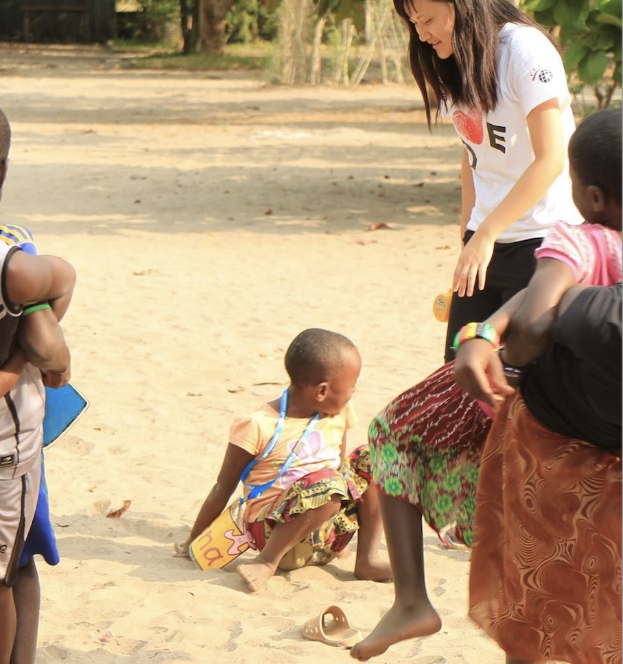
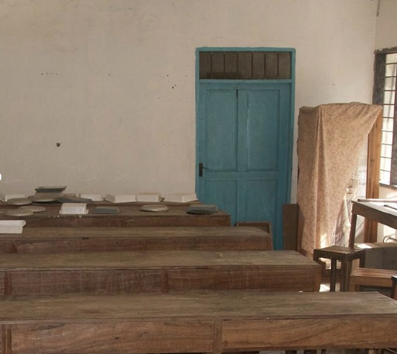

# My Life-Changing Journey in Tanzania

In Tanzania, I saw how acts of kindness — even the smallest gestures made a significant difference. I heard said that "kindness not just an action, but it is a way of life"

This journey reminded me that we are all connected. Living with intention of feeling for everyone and being kind would give meaning to every step we take. Tanzania taught me that being kind is not optional — it is essential.

---

Whilst there, I was involved in helping with computer teaching, setting up computer classrooms, and engaging in cultural exchange.  
This trip changed my life entirely — it taught me to see the light, to always appreciate, and to be willing to help as much as I can.  

There were so many moments of laughter, singing, and heartwarming connection. God reminded me again and again to be gentle and live in the moment, and I am deeply grateful for that.  

---
 

I also had the chance to learn Kiswahili and experience the highs and lows of moving to another country. It was not always easy, but this experience made me independent and showed me how to connect with others across the globe.  

The joy of knowing that life, with all its unknowns, always finds its way gave me peace.  
 
