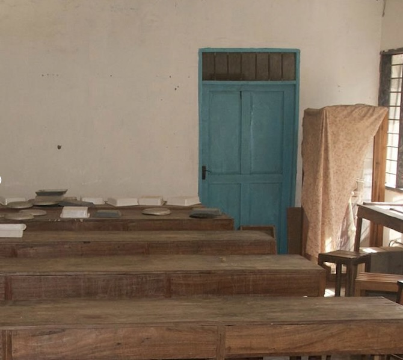
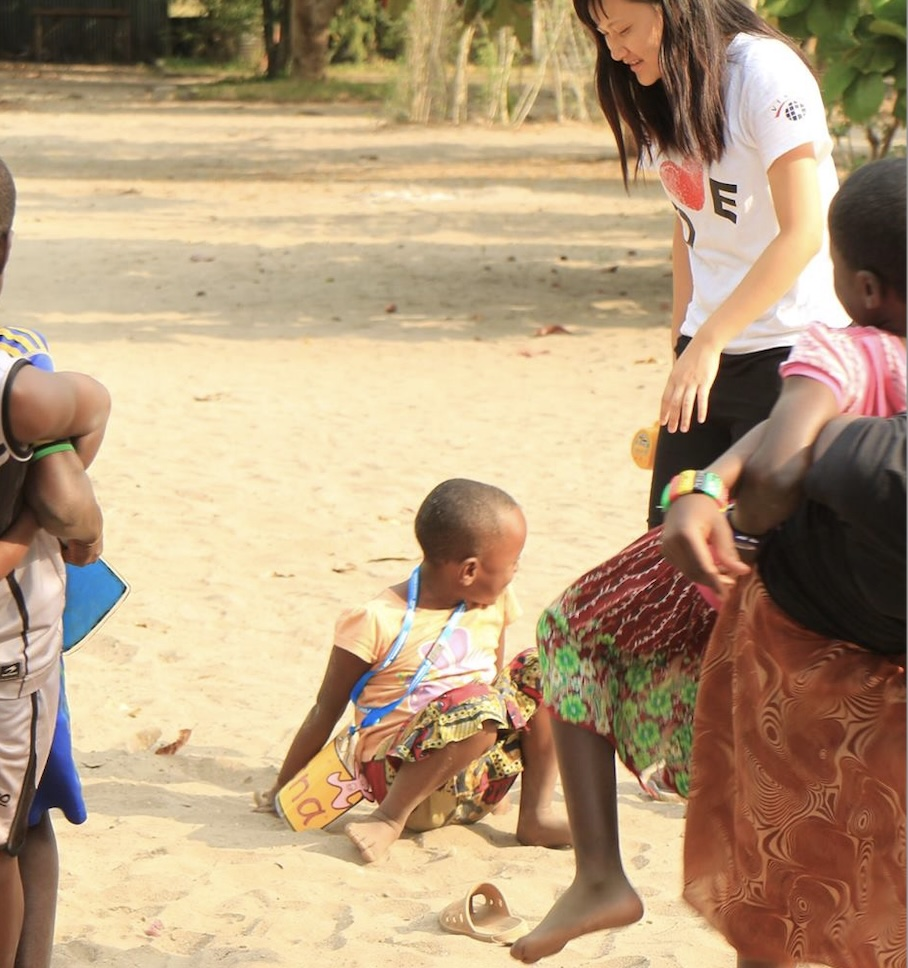

<!DOCTYPE html>
<html lang="en">
<head>
<meta charset="UTF-8">
<meta name="viewport" content="width=device-width, initial-scale=1.0">
<title>Personal Journey</title>

</head>
<body>

    <h1>Personal Journey</h1>

    
In 2014 summer, Tanzania, this journey reminded me that we are all connected. Having purity in heart and positive attitudes made a significant difference. I've learned a lot through the people I met here, and whilst being a volunteer I was getting a lot of help from local people. Their kindness changed my heart.

    
Whilst there, I was involved in helping with computer teaching, setting up computer classrooms, and engaging in cultural exchange. 
    This trip changed my life entirely — it taught me to see the light, to always appreciate, and to be willing to help as much as I can.

    
There were so many moments of laughter, singing, and heartwarming connection. God reminded me again and again to be gentle and live in the moment, and I am deeply grateful for that. I am very thankful for everyone I met here.

    

    <h2>My Life-Changing Journey in Tanzania</h2>
    
This experience made me independent and showed me the ways of building my life in a place that was completely new to me. The joy of knowing that life, with all its unknowns, always finds its way gave me peace.

    
    

</body>
</html>
