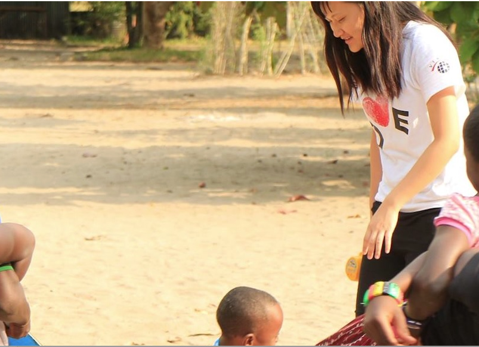

# My Life-Changing Journey in Tanzania

Travelling to Tanzania was not merely a trip — it was a turning point in my life.  
I arrived curious, with open eyes and an open heart, yet I had no idea how deeply the experience would transform me.

Amidst the breathtaking landscapes, the warmth of the people, and the richness of culture, I discovered more than beauty — I discovered strength.  
Challenges that once seemed overwhelming began to feel like stepping stones. I learnt that resilience is not about never falling, but about rising each time with greater courage.

In Tanzania, I also found purpose. I witnessed how acts of kindness — even the smallest gestures — could ripple outward and make a difference. Whether it was sharing food, lending a hand, or offering a simple smile, kindness became not just an action, but a way of life.

This journey reminded me that we are all connected. Living with intention and compassion gives meaning to every step we take. Tanzania taught me that being kind is not optional — it is essential.

✦ ✦ ✦

While there, I had the privilege of helping with computer teaching, setting up computer classrooms, and engaging in cultural exchange.  
This trip changed my life entirely — it taught me to see the light, to remain grateful, and to be willing to help as much as I can.  

There were countless moments of laughter, singing, and heart-warming connection. Time and again, God reminded me to be gentle and to live in the present moment, and for that I am deeply grateful.  

I also had the opportunity to learn Kiswahili and to experience both the highs and lows of moving to another country. It was not always easy, yet the experience shaped me into an independent person and taught me how to connect with others across the globe.  

The joy of knowing that life, with all its uncertainties, always finds its way gave me peace. I discovered that friendships can blossom anywhere, and that wherever I may be, or whatever I may do, I can choose to live gently and kindly.  

This journey is etched upon my heart forever — a reminder that kindness, gratitude, and purpose carry us through every chapter of life.  

